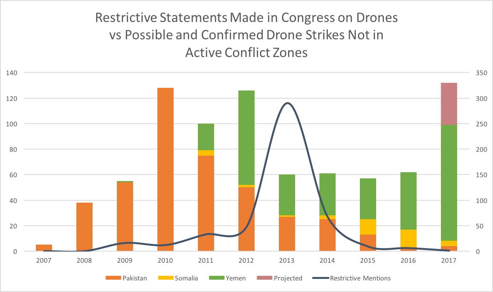

# Preliminary Findings
#### *Sarah Kreps and Miles McCain*

_This is a document where we document our preliminary research findings for the public. This research has not yet been officially published._

## Overview
Using a digitized version of the Congressional Record (accessed via [GPO.gov](https://gpo.gov)), we scanned every single statement made in Congress since January 01, 2000 for mentions of military drones. We automatically filtered out statements likely to be irrelevant (such as those which mention the `FAA`, which would imply a discussion of domestic drone usage), and then manually filtered and classified each matching statement according to its sentiment (pro-drone, anti-drone, or neutral). For the purposes of the research at this stage, we only consider anti-drone (restricting) statements for our statistical analysis.

#### General findings
We found that since 2007, there have been only 482 restrictive mentions of drones in the Congressional Record. (For reference, it is estimated that there are 28,890 [mentions](https://www.congress.gov/search?searchResultViewType=expanded&q={%22source%22:%22congrecord%22,%22search%22:%22defense%22,%22congress%22:[%22110%22,%22111%22,%22112%22,%22113%22,%22114%22,%22115%22]}) of `defense` during the same time frame). We found that there is little correlation between the magnitude of drone strikes and the number of mentions of drones in Congress.

_Figure 1. The magnitude of drone strikes versus the number of restrictive drone mentions in Congress. Strike data from the Bureau of Investigative Journalism. Due to the difficulty in distinguishing between an air strike and a drone strike, it is possible that some air strikes are included in the shown totals._

#### Corroboration
The number of restrictive mentions of drones we found in the Congressional Record is supported by a [search](https://www.congress.gov/search?q={%22source%22:%22congrecord%22,%22search%22:%22drones%22}&searchResultViewType=expanded) for `drone` and `uav` on the Congress.gov website, which yields 723 results. When considering that many of these statements are about domestic drones, are pro-drone, or simply mention `drone` in a separate context, our count of statements is to be expected. _(Please see the `Definitions` sections at the end of this document for our detailed definition of what constitutes a statement.)_

## Our Process
Our dataset of legislative engagement on drones was based on data from the Congressional Record that was then winnowed in the following manner. 

### 1. Getting the data from the Congressional Record

The Congressional Record is published in batches of ZIP files online. We used a modified version of a [program](https://github.com/unitedstates/congressional-record) originally written by the Sunlight Foundation to download these ZIP files onto a personal computer. We then used a "wrapper" program that we wrote to run the modified version of the Sunlight Foundation's program on every day since January 01, 2000.

We wrote a short program that combined all of the fragmented and scattered Congressional Record documents that we had downloaded into a single file. The code for this program is open source and is available at <https://github.com/milesmcc/combine-cr/blob/master/combine.py>. 

At this point, we had downloaded and group the entire Congressional Record into a single file (roughly 3.5 gigabytes). Unfortunately, this data was missing many key features (which simply weren't often provided by the government publishing office):

- full names of the speakers (often, speakers are simply referred to as 'Mr. JONES', making identity matching difficult)

- partisan affiliations of the speakers

- home-states of the speakers

To collect this data, we built another program which then 'annotated' (processed) the congressional record.

### 2. Processing and parsing the data from the Congressional Record

The next step was to take the aggregated Congressional Record and split it into individual statements, associating with each statement a politician. We had the following data from the previous stage:

- The last name of the speaker

- Sometimes, we had the first name _and_ home state of the speaker, extrapolated from the Congressional Record sub-headers which sometimes included text similar to "HON. JAMES MATTHEWS of **north carolina**"

- The date that the statement was made

We also downloaded the [biographical information and term data](https://github.com/unitedstates/congress-legislators) of every single United States legislator since ~1780 from the *United States* project, an open-data initiative led by the Sunlight Foundation, GovTrack.us, the *New York Times*, the Electronic Frontier Foundation.

We then wrote a program which took the aggregated Congressional Record from the previous stage and split it into paragraphs. These paragraphs are kept in the order in which they appeared in the Congressional Record, however each is given its own metadata. (We did this because we found that often, two or three congresspeople would speak in a single "record." This is due in large part to interjections, questions, comments, and conversations during/after/before speeches and/or presentations.) Whenever a different person speaks, the Congressional Recorder inserts a paragraph break. These paragraphs are usually around 100 words long.

The program then iterated over each of these paragraphs (there are 6,215,134 in our dataset), and for each one it attempted to match its speaker with a member of Congress in the *United States Legislators* dataset (from the *United States* project). We designed the matching algorithm to avoid false associations. Because nearly 25% of Congresspeople share a last name with another Congressperson, associations based on last names alone were not precise enough. As a result, the algorithm we designed checked the following:

- That the last names matched

- That the first names matched (if available)

- That the home states matched (if available)

- That the statement was made while the potential matching legislator was in office

- That the sex of the speaker (extrapolated from the Congressional Record's use of gendered pronouns) matches the sex of the potential associated legislator. (As far as we are aware, there has yet to be any transgender/gender-nonconforming congresspeople, so this doesn't present any possibility of false positives.)

*If data was unavailable for any of the previous sections, it is treated as though it were a match, except for the last name, which must always match in order for biographical metadata to be associated with a statement. If, for any statement, there was any uncertainty in the match (i.e. two possible legislators fit all the categories above), the match was ignored and instead listed as "unknown" to prevent false matches.*

Our association algorithm also recognizes legislators from various U.S. territories. For example, it correctly associated a statement made by "Ms. BORDALLO" to Madeleine Bordallo, a delegate to the House for the territory of Guam.

About 90% of statements in the Congressional Record were successfully associated with a legislator. A significant portion of the unmatched paragraphs were roll-calls and interjections from the presiding speaker, which were listed in the Congressional Record under "The SPEAKER" or "The ACTING PRESIDENT PRO TEMPORE." (These statements were generally similar to "The bill clerk read the following letter:" and "Thereupon, the Senate, at 12:00 and 30 seconds p.m., adjourned until Friday, May 30, 2014, at 2 p.m.", and added little value to our dataset).

This program, which is available at <https://github.com/milesmcc/combine-cr/blob/master/annotate.py>, then created a new, "annotated" Congressional Record file. This file is roughly 7 gigabytes.

### 3. Searching the Congressional Record

Searching the Congressional Record for mentions of foreign drones (and automatically filtering out mentions of domestic drones) is perhaps the most immediately obvious and important tasks required to create our dataset. Similarly important, however, is that the code created to search the Congressional Record is generalizable, so that we can perform additional searches---and compile additional datasets---quickly and easily.

We designed a program that provides an easy-to-design and powerful platform to search the congressional record. A single search takes about ten minutes to perform (at the rate of about 10.5k paragraphs per second), and automatically exports a spreadsheet like the one attached. The code is open-source, and available at <https://github.com/milesmcc/combine-cr/blob/master/search.py>.

We chose to match paragraphs as the smallest unit of "legislative engagement" (i.e. what shows up as a *mention/statement* in our spreadsheet) as opposed to, say, words, sentences, or entire documents, because paragraphs strike a balance between context and concentration. Searching *paragraphs* for mentions of drones (and filtration of domestic drones) provides the following benefits:

- Speeches which focus primarily on military drones but acknowledge the existence and virtues of domestic drones are not filtered out.

- Speeches which focus entirely on drones (and mention them in most, if not all, or its paragraphs) are weighted more greatly in final figures than individual tangential mentions.

- ...however *paragraphs* which mention drones a few times will not be counted five, six, or seven times. Instead, they will only be counted once.

- Proper context for the drone statement will be provided to our classifier (which would not be available if we matched sentences, instead).

- Paragraphs which mention the FAA or Homeland Security or the U.S. border and then begin to talk about drones in a later sentence will be correctly filtered out.

These are the exact parameters we specified for the search program:

- If the word `border` appears in the paragraph and `Afghan[istan]` or `Pakistan` does NOT appear in the paragraph, skip the paragraph. (This is meant to filter out paragraphs which discuss the use of drones on the American border while still including paragraphs that discuss the use of drones on the Pakistan-Afghanistan border.)

- If the phrase `American soil` appears in the paragraph and drone-affected countries do NOT appear in the paragraph, skip this paragraph. (This is meant to filter out paragraphs which discuss the use of drones in America, while still including statements such as `these drone strikes in Pakistan will prevent terrorist attacks on American soil.`)

- The paragraph MUST include at least one of the following words: *drone, UAV,* or *unmanned aerial vehicle*. We chose not to include *strike* because not only is it usually preceded by "drone" when used in the context we are searching for, but it is also often used in unrelated circumstances (which would raise the amount of false positives in our dataset).

- The paragraph MUST NOT include any of the following words: `commerc[e/ial]`, `Amazon`, `Bezos`, `Homeland Security`, `DHS`, `FAA`, `Federal Administration Association`, `police`, `secret service`, `pipeline`, or `survey`. We chose these terms because I found that they very effectively filtered out mentions of domestic drones.

Any paragraph which matched all the aforementioned criteria are included in attached dataset.

### 4. Classifying the Congressional Record

All mentions of drones in the Congressional Record are classified in the following ways:

_Please note that at this stage in the research, not all of the below classifications have been completed for the entire dataset. As of August 22, 2017, we have read each statement and classified it according to its `general sentiment` (explained below) and its `relevance`._

#### Relevance

-   Not all of the automatically-detected drone statements will be relevant to warfare-drones overseas.

-   Take, for example, the following statement made by Ted Poe of Texas: "The third thing I wanted to mention in the remaining time is a completely different issue, but it has to do with drones, the right of privacy. We are in the drone age. It is estimated that by 2030 we will have 30,000 drones over the skies of the United States, 30,000 of them."

-   This statement is referring to the use of drones domestically, and it is therefore not relevant to our purposes. In the 'relevance' column, it should be marked as IRRELEVANT.

-   It is not necessary to classify the statement in the other categories if the statement is irrelevant.

-   Also irrelevant are statements which mention drones in a surveillance role, such as: "Last year we sponsored a demonstration for the Global Hawk system in an air surveillance role. This bill includes funding for a signals intelligence demonstration project using the Global Hawk UAV. We think it is an important addition to our repertoire of overhead reconnaissance."

#### Category

-   Classify what issue of drones the statement primarily refers to.

-   Possible categories:

-   FOREIGNPOLICY --- how drones affect the foreign policy of the United States (e.g., counterproductive because strikes antagonize the local populations and increase terrorism vs effective counterterrorism measure, etc).

-   PTSD --- statements about how drones affect post-traumatic stress disorder (PTSD) at large in the armed forces or in their district

-   JOBS --- statements about how drones affect jobs in the United States (bases in the district, contractors, etc)

-   HUMANITARIAN --- statements which touch on the humanitarian element of drones (civilian casualties as a problem in itself?)

-   FINANCE --- statements about the effect of drones on the finances of the U.S. government

-   TECHNOLOGY --- statements about lethal-drone technology (NOT surveillance drones)

-   INTERNATIONAL-LEGALITY --- statements about the legality of drone strikes in international law

-   DOMESTIC-LEGALITY --- statements about the legality of drone strikes in domestic law

-   REFERENCE --- for statements which only reference the drone program (or a particular drone strike) and do not delve into any of the aforementioned categories.

-   DISCLOSURE --- for statements which reference the disclosure of information related to the U.S. drone program. A 'PRO' categorical sentiment in the category of 'DISCLOSURE' would mean that the statement called for greater disclosure of information about the U.S. drone program (and would likely be accompanied by an 'ANTI' general sentiment classification), while a statement which was against the disclosure (unauthorized or otherwise) of information about the drone program would have an 'ANTI' categorical sentiment (and likely a 'PRO' general sentiment).

-   If a statement potentially fits into two or more of these categories, they may be listed in the form of a comma-separated list (without spaces). For example: LEGALITY,HUMANITARIAN.

#### Categorical Sentiment

-   Whether the statement is pro-drone, anti-drone, or neutral to drones within its category. For example, a statement such as "drones are wonderful, so we need to make them cheaper!" would be pro-drone in general, but anti-drone in terms of finances.

-   In the 'categorical sentiment' column, list the sentiment(s) in order of the category(/ies). For example, if a statement has multiple categories (i.e. TECHNOLOGY,JOBS), list the categorical sentiments in the same order in which the categories were listed (i.e. ANTI,PRO if the statement is critical of drone technology but positive toward drone job creation).

#### General Sentiment

-   Whether the statement---independent of category---is pro-drone, neutral, or anti-drone.

-   In the spreadsheet, such classifications should be listed in the 'general sentiment' column as PRO, NEUTRAL, or ANTI, respectively.

-   Example of a pro-drone statement: "And the military assets most useful for counterterrorism are relatively inexpensive such as surveillance technologies, special operations forces and drones." (7/30/10, Mike Quigley).

-   Example of an anti-drone statement: "We may in fact be less safe. There is plenty of evidence to suggest that Al Queda has been strengthened by the US support for military action in Iraq, Afghanistan, Pakistan, Syria, Yemen and by extrajudicial killings through the use of drones which are exacting a high toll on innocent civilians." (1/1/13, Dennis Kucinich).

-   Example of a "judgement call": "There is a quote that I think sort of brings this and makes this very poignant. There is a quote from an ex-CIA agent--I think it is Bruce Riedel--who says: The drone strike program is sort of like a lawnmower. You can keep mowing them down, but as soon as the lawnmower stops, the grass grows again." (3/6/2013, Brennan Nomination).

-   Generally, this statement is critical of the drone program, however it is not immediately obvious one way or the other. In cases such as these, the "justification" column is very important.

#### Justification

-   Transparency is of the utmost importance in academic research, especially when dealing with topics as politically salient as drones and drone warfare. As such, a justification will need to be provided for the classifications of each record. These may be brief---only a few words are necessary for each sub-classification (relevance, sentiment, category, and categorical sentiment)---however they must be honest and correct.

-   We indicate any non-obvious judgement calls or difficult decisions in the justification field by including "[NON-OBVIOUS]" (with brackets) at the beginning of our justification.

## Definitions
**Statement** --- a statement, for the purposes of this research, is a piece of text (typically around 100 words) separated by a non-wrapping line break in the digitized version of the Congressional Record. Please refer to section 3 of our process section for a detailed explanation of why we chose a paragraph as the smallest unit of legislative engagement.
